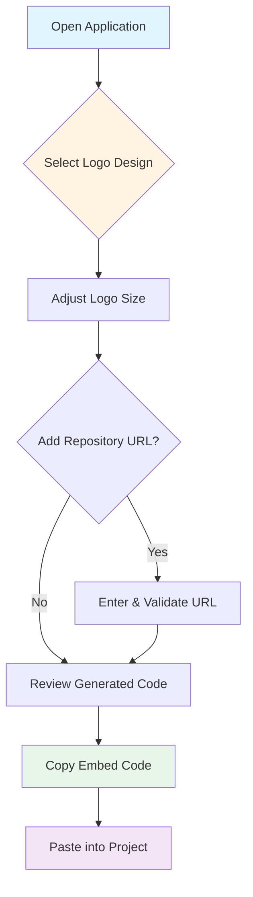

# xsukax GitHub Logo Embed Code Generator

A lightweight, client-side web application that enables developers to generate customizable GitHub logo embed codes with precision and ease. This tool streamlines the process of integrating professional GitHub branding into web projects, documentation, and README files without requiring external dependencies or server-side processing.

**🔗 Live Demo:** [https://xsukax.github.io/xsukax-Github-Logo-Embed-Code-Generator](https://xsukax.github.io/xsukax-Github-Logo-Embed-Code-Generator)

---

## 🔒 Security and Privacy Benefits

This application is architected with security and privacy as foundational principles:

- **Zero Data Transmission**: All processing occurs entirely within the user's browser. No repository URLs, configuration data, or user inputs are transmitted to external servers or third-party services.

- **No Backend Dependencies**: The application operates as a purely client-side tool, eliminating server-side vulnerabilities, data breaches, and unauthorized access risks associated with backend infrastructure.

- **Local Storage Isolation**: No cookies, local storage, or session storage mechanisms are employed, ensuring that no user data persists beyond the current browser session.

- **Transparent Code Generation**: All generated embed codes are visible in plain text before copying, allowing users to audit and verify the output for security considerations.

- **Self-Contained Architecture**: The single HTML file contains all necessary code (HTML, CSS, JavaScript), reducing attack surface area and external dependency risks.

- **CDN Usage Transparency**: The application utilizes only Tailwind CSS via CDN for styling, with no tracking scripts, analytics, or third-party monitoring tools integrated.

- **Open Source Auditability**: The complete source code is available for public inspection, enabling security researchers and developers to verify implementation and identify potential vulnerabilities.

---

## ✨ Features and Advantages

- **Multiple Logo Variants**: Choose from four professionally designed GitHub logo options:
  - GitHub Mark (White) - Ideal for dark backgrounds
  - GitHub Mark (Black) - Suitable for light backgrounds
  - GitHub Text Logo (Black) - Full wordmark for enhanced brand visibility
  - GitHub Text Logo (White) - Wordmark variant for dark themes

- **Dynamic Size Customization**: Adjust logo height from 16px to 256px using an intuitive slider interface, with automatic width calculation maintaining proper aspect ratios.

- **Intelligent Aspect Ratio Preservation**: The application automatically calculates and applies correct width dimensions based on each logo's intrinsic aspect ratio, ensuring visual fidelity across all sizes.

- **Repository Linking**: Optional GitHub repository URL validation enables generated logos to function as clickable links directing users to specified repositories.

- **Real-Time Preview**: Visual preview pane with context-appropriate background colors (dark backgrounds for white logos) allows immediate verification of appearance.

- **One-Click Code Generation**: Instantly generates clean, semantic HTML/SVG embed code ready for integration into any web project or markdown file.

- **Clipboard Integration**: Seamless copy-to-clipboard functionality with visual feedback notifications for improved user experience.

- **Responsive Design**: Fully responsive interface built with Tailwind CSS, providing optimal viewing experience across desktop, tablet, and mobile devices.

- **GitHub README Compatibility**: Generated code works seamlessly in GitHub README.md files, which support inline SVG rendering.

- **Zero Configuration Required**: No installation, dependencies, or build processes—simply open the HTML file in any modern web browser.

---

## 📦 Installation Instructions

### Method 1: Direct Browser Usage (Recommended)

1. **Download the Repository**:
   ```bash
   git clone https://github.com/xsukax/xsukax-Github-Logo-Embed-Code-Generator.git
   cd xsukax-Github-Logo-Embed-Code-Generator
   ```

2. **Open in Browser**:
   - Locate the `index.html` file in the cloned directory
   - Double-click to open in your default web browser, or
   - Right-click and select "Open with" to choose a specific browser

### Method 2: Web Server Deployment

For hosting on a web server or local development server:

```bash
# Using Python's built-in HTTP server
python -m http.server 8000

# Using Node.js http-server (requires npm install -g http-server)
http-server -p 8000

# Using PHP's built-in server
php -S localhost:8000
```

Navigate to `http://localhost:8000` in your web browser.

### Method 3: GitHub Pages (Public Hosting)

1. Fork this repository to your GitHub account
2. Navigate to repository Settings → Pages
3. Select the main branch as the source
4. Access your deployment at `https://[your-username].github.io/xsukax-Github-Logo-Embed-Code-Generator`

### Requirements

- Modern web browser with JavaScript enabled (Chrome 90+, Firefox 88+, Safari 14+, Edge 90+)
- Internet connection for Tailwind CSS CDN (required only on first load; cached thereafter)

---

## 📖 Usage Guide

### Basic Workflow



### Step-by-Step Instructions

#### 1. Select a GitHub Logo Design

- Browse the four available logo variants displayed in the grid
- Click on your preferred design—the selection will be highlighted with a blue border
- Consider your target background color when choosing between white and black variants

#### 2. Customize Logo Dimensions

- Use the height slider to adjust the logo size between 16px and 256px
- The width automatically adjusts to maintain the correct aspect ratio
- Observe the real-time preview to verify the appearance at your selected size

#### 3. (Optional) Link to Your Repository

- Enter your GitHub repository URL in the format: `https://github.com/username/repository`
- Click "Validate URL" to verify the format
- Upon successful validation, the generated code will wrap the logo in a clickable link
- A "🔗 Linked" badge appears when a valid repository URL is active

#### 4. Copy the Generated Code

- Review the generated HTML/SVG code in the dark code block
- Click the "Copy Code" button to copy the entire snippet to your clipboard
- A success notification confirms the copy operation

#### 5. Integrate into Your Project

**For HTML Files:**
```html
<!-- Paste directly into your HTML document -->
<header>
  <!-- Generated code here -->
  <a href="https://github.com/yourusername/yourrepo" target="_blank" rel="noopener noreferrer">
    <svg viewBox="0 0 98 96" xmlns="http://www.w3.org/2000/svg" width="65" height="64">...</svg>
  </a>
</header>
```

**For GitHub README.md:**
```markdown
# Your Project Title

<!-- Paste the generated code -->
<a href="https://github.com/yourusername/yourrepo" target="_blank" rel="noopener noreferrer">
  <svg viewBox="0 0 98 96" xmlns="http://www.w3.org/2000/svg" width="65" height="64">...</svg>
</a>

Your project description...
```

### Architecture Overview


### Advanced Customization

The generated SVG code can be further customized by modifying attributes directly:

```html
<!-- Change fill color -->
<svg fill="#0366d6">...</svg>

<!-- Add CSS classes -->
<svg class="github-logo custom-class">...</svg>

<!-- Apply inline styles -->
<svg style="filter: drop-shadow(2px 2px 4px rgba(0,0,0,0.3));">...</svg>
```

---

## 📄 License

This project is licensed under the GNU General Public License v3.0.

---

## 🤝 Contributing

Contributions, issues, and feature requests are welcome! Feel free to check the [issues page](https://github.com/xsukax/xsukax-Github-Logo-Embed-Code-Generator/issues).

---

## 👤 Author

**xsukax**

- GitHub: [@xsukax](https://github.com/xsukax)
- Repository: [xsukax-Github-Logo-Embed-Code-Generator](https://github.com/xsukax/xsukax-Github-Logo-Embed-Code-Generator)

---

## ⭐ Show Your Support

If you find this tool useful, please consider giving it a star on GitHub! Your support helps maintain and improve the project.
